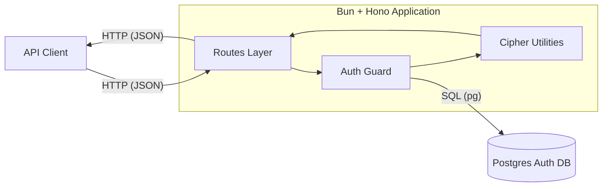
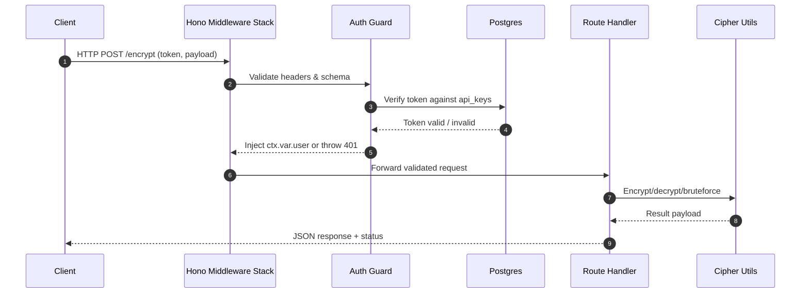
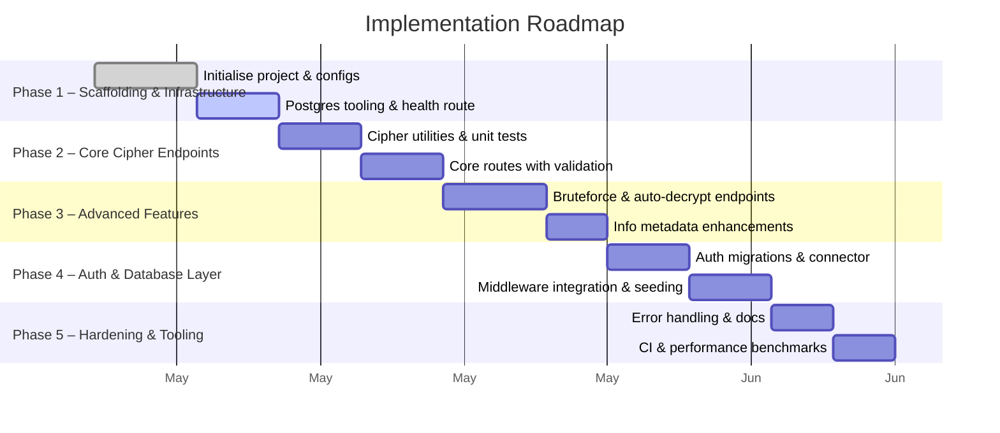

# Design – Caesar Cipher API

## System Architecture Overview

- **Decision: Single Bun process running Hono router.** Enables end-users to receive low-latency responses (<100 ms, NFR-001) because Bun’s runtime and Hono’s lightweight router minimise overhead.
- **Decision: Postgres dedicated to authentication data.** Ensures only authorised clients can call mutation endpoints (US-09) while keeping cipher operations stateless for speed; end-users trust that data is protected without suffering rate limits (per constraint).

### Request Flow with Authentication

- **Decision: Central middleware validation.** Keeps every request consistent, so developers can rely on predictable 400/401 responses when inputs are bad—letting end-users self-diagnose integration issues quickly.
- **Decision: Separation of auth check and business handler.** Allows cipher logic to remain pure and fast, meaning authenticated users always experience quick responses.

## Technical Design Details
### Routing & Request Lifecycle
- **Hono route modules per endpoint (`api/src/routes/*.ts`).** Satisfies FR-002; end-users (API consumers) get predictable URLs defined in README. Decoupling routes keeps responses consistent, helping developers integrate and validate via `curl` or tests quickly.
- **Shared middleware stack:**
  - JSON body parser and schema validation (FR-003) using lightweight checks (e.g., Valibot/Zod). This prevents malformed inputs reaching business logic, ensuring users receive helpful error messages (`code` + `message`, NFR-003).
  - Authentication middleware injecting `ctx.var.user`. This centralises CC-AUTH requirements so end-users with valid tokens never see unexpected 401 responses.

### Cipher Logic Module
- **Pure TypeScript utility (`api/src/utils/caesar.ts`).** Implements FR-001 with functions `shiftChar`, `encrypt`, `decrypt`, `bruteForce`, and `autoDecrypt`. Pure utilities make unit testing straightforward, ensuring developers can confirm correctness across the 0–25 range (US-01..US-06).
- **Auto-decrypt heuristics:** frequency analysis with fallback bigram scoring. This maximises success rate for analysts (US-06) while keeping computational complexity linear in text length, preserving performance budgets.

### Authentication & Postgres Integration
- **Token-based auth with bearer tokens.** Tokens map to `api_keys` table containing hashed secrets and scopes. This design allows clients to self-validate by storing one token locally and testing via `curl -H "Authorization: Bearer …"` (US-09).
- **Database Access Layer:**
  - Use Bun’s `@bun/sql` client or `pg` driver depending on stability. Provide `db.ts` with pooled connection (TR-005).
  - Migrations managed with SQL files in `api/db/migrations` executed by `bun run migrate` (TR-006). This guarantees reproducible auth tables for contributors.
- **Seed Script (`bun run seed:local`).** Inserts demo user/token pair meeting CC-AUTH-003. Developers validate auth flow by seeding DB then calling `/encrypt` with the seeded token, ensuring end-user onboarding friction is low.

### Configuration & Environment Management
- **Central config module (`api/src/config.ts`).** Reads `PORT`, `DATABASE_URL`, `JWT_SECRET` etc., typed via `zod` schema to avoid runtime surprises (TR-007). Clear errors on startup help developers configure local environments quickly.
- **`.env.example` documentation.** Aligns with requirements to document new variables, so end-users (contributors) can set up Postgres and auth secret without guesswork.

### Logging & Observability
- **Structured logger (e.g., `console.log` with JSON).** Includes route, duration, status (FR-004). Enables developers to trace requests while debugging integration scenarios.
- **Health check composition:** `/health` aggregates DB connectivity and warm cache status, satisfying CC-HEALTH-001 and giving operators immediate feedback when validating deployments.

### Build & Deployment Preparation
- **`package.json` scripts:** `dev`, `test`, `build`, `migrate`, `seed:local` (FR-005, TR-006). Scripts ensure contributors can execute workflows uniformly, enabling end-users to reproduce behaviour and trust API stability.
- **Bun bundling:** `bun build src/server.ts --outdir dist` (TR-002) ensures a production-ready bundle without TypeScript at runtime, reducing cold-start latency for eventual deployments.

### API Documentation Strategy
- **Generated OpenAPI spec (`api/docs/openapi.yaml`).** Derived from route definitions to document request/response schemas. Developers use the spec to generate clients, ensuring they can script encryption workflows and validate via schema-aware tools (e.g., Postman collection).
- **Doc validation workflow:** After updating routes, run `bun run doc:check` to ensure schemas align with implementation, giving end-users confidence in contracts.

## Implementation Phases

- **Decision: Phase-based roadmap.** Gives contributors clear order of operations so that foundational work (config, health) is proven before advanced features. End-users benefit because each release phase delivers verifiable functionality they can test immediately.

### Phase 1 – Project Scaffolding & Infrastructure
- Initialise Bun project, configure TypeScript `strict` mode (TR-001), create base folders (`routes`, `utils`, `config`, `db`).
- Add Postgres docker-compose and env templates (TR-005, TR-007).
- Set up logging and health route returning static success (CC-HEALTH-001). End-user benefit: immediate ability to verify server is reachable.

### Phase 2 – Core Cipher Functions & Endpoints
- Implement `caesar.ts` utilities plus unit tests covering all shifts (FR-001, TR-004).
- Build `/encrypt`, `/decrypt`, `/encode`, `/rot13` routes with validation middleware (US-01..US-04). Users can now test encryption flows via `bun run dev` + `curl`.
- Add README snippets for usage so developers confirm outputs manually, aiding success.

### Phase 3 – Advanced Cipher Features
- Implement `/bruteforce` and `/auto-decrypt` using shared helpers (US-05, US-06).
- Enhance `/info` route to surface metadata (US-08).
- Introduce performance benchmarks ensuring responses meet NFR-001/002.

### Phase 4 – Authentication & Database Layer
- Define migrations for `api_keys` table, implement DB connector (TR-005, TR-006).
- Build auth middleware enforcing bearer tokens and integrate with all routes except `/health` and `/info` (US-09, FR-006).
- Create seed script establishing demo credential; document validation steps (`bun run seed:local`, `curl` with token). End-users confirm secure access without manual DB edits.

### Phase 5 – Hardening & Tooling
- Implement structured error handler returning `{ code, message }` (NFR-003).
- Finalise OpenAPI spec and doc workflow, ensuring developers can generate clients.
- Add CI workflows (stubbed locally) to run `bun test`, migrations, and lint (TR-005). Ensures consistent quality before future deployment considerations.

## Testing Strategy
- **Unit Tests:** Cipher utilities (`encrypt`, `decrypt`, `autoDecrypt`, `bruteForce`) covering edge cases like empty strings, punctuation, non-ASCII (FR-001, CC-* requirements). Confirms end-users receive correct transformations.
- **Integration Tests:** Route-level specs using Hono test client verifying status codes, payload shape, auth enforcement, and version sourcing (US-01..US-09, CC-INFO-002). Guarantees clients can rely on documented contracts.
- **Authentication Tests:** Seed DB within test harness, validate 401 for missing/invalid tokens and 200 for valid ones (CC-AUTH-001..003). Ensures end-users experience secure yet accessible API.
- **Performance Benchmarks:** Automated check ensuring `/health` <50 ms (CC-HEALTH-002) and cipher endpoints <100 ms for 1k-char payloads (NFR-001). Keeps user interactions snappy.
- **Coverage Tracking:** Configure Bun coverage reporting to enforce ≥90% statement coverage on utilities (TR-004). High coverage supports user trust in correctness.
- **Manual Verification Playbook:** Document `curl` commands (e.g., `curl -H "Authorization: Bearer <token>" -d '{"text":"hello","shift":3}' http://localhost:3000/encrypt`) so developers directly validate functionality, mirroring end-user workflows.

By executing this design, contributors deliver an authenticated, well-documented Caesar Cipher API that meets functional and non-functional requirements while giving consumers clear pathways to validate encryption, decryption, and discovery workflows.
